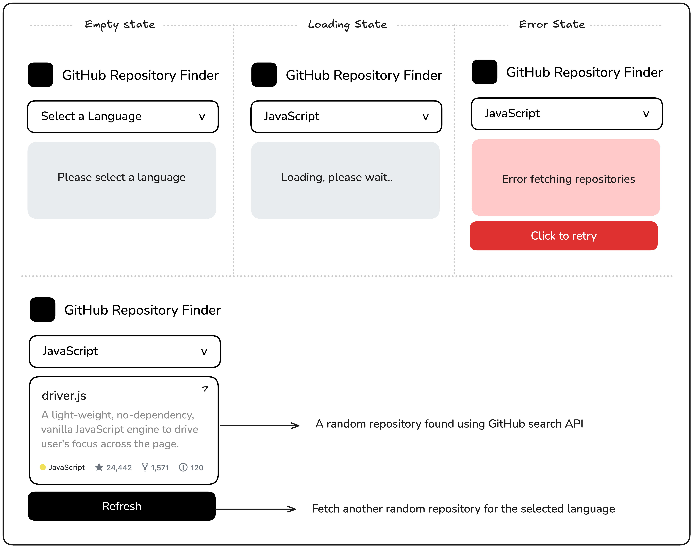

# GitHub Random Repo Finder

This project is a **GitHub Random Repository Finder** that allows users to select a programming language and fetch a random popular repository from GitHub. The project is built using **Tailwind CSS** for styling and **JavaScript (Fetch API)** for fetching repository data.

## 🚀 Features
- Select a programming language from a dropdown.
- Fetches a random repository from GitHub based on the selected language.
- Displays repository details like name, description, stars, forks, and issues.
- Loading state while fetching data.
- Error handling with UI feedback.

## 📷 Screenshot


## 📚 Learn More  
For more guidance on building a Task Tracker, check out this roadmap:  
[GitHub Random Repository](https://roadmap.sh/projects/github-random-repo)


## 🛠️ Technologies Used
- **HTML** - Structure of the page.
- **Tailwind CSS** - Styling framework.
- **JavaScript** - Handles fetching and UI updates.
- **GitHub API** - Fetches repository data.

## 📂 Project Structure
```
📦 GitHub-Random-Repo-Finder
├── 📜 index.html         # Main HTML file
├── 📜 script.js          # Core functionality
└── 📜 README.md          # Project documentation
```

## ⚡ Getting Started

1. **Clone the repository**
   ```sh
   git clone https://github.com/yogendrabhammarkar57/git-random-repository-finder.git
   ```
2. **Navigate to the project folder**
   ```sh
   cd github-random-repo-finder
   ```
3. **Open `index.html` in your browser**
   ```sh
   open index.html
   ```

## 📌 Usage
1. Click on the dropdown to select a language.
2. The app fetches a random repository in that language.
3. View details such as description, stars, forks, and open issues.
4. Click the **Refresh** button to fetch another random repository.

## ❗ API Limitations
GitHub API has rate limits, so excessive usage may result in request blocking. If the data is not loading, try again after some time.

## 📜 License
This project is open-source and available under the **MIT License**.

---
Made with ❤️ using Tailwind CSS & JavaScript.

